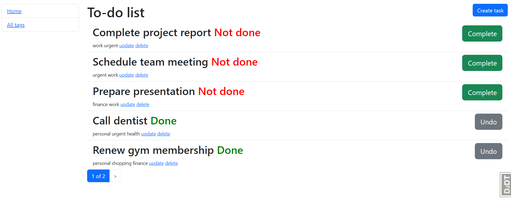

# To-Do List Project

## Description
This is a simple To-Do List web application that allows users to manage their tasks efficiently. Users can create, update, delete, and complete tasks while also categorizing them with tags. The project follows a structured implementation with a sidebar navigation and a responsive interface.

## Home page


## Features
- Create, update, delete, and complete tasks.
- Tasks contain:
  - Content (description of the task)
  - Datetime (when the task was created)
  - Optional deadline datetime
  - A boolean field to mark the task as done or not
  - Tags for categorization
- Create, update, and delete tags.
- Sidebar navigation available on all pages.
- Task ordering:
  - Not done tasks appear first
  - Tasks are ordered from newest to oldest
- Buttons to add new tasks and tags.
- Task completion toggle button (Complete/Undo Completion).

## Installation
1. Clone the repository:
   ```sh
   git clone https://github.com/uzlss/to-do-list.git
   ```
2. Navigate to the project directory:
   ```sh
   cd to-do-list
   ```
3. Install dependencies:
   ```sh
   pip install -r requirements.txt
   ```
4. Apply migrations:
   ```sh
   python manage.py migrate
   ```
5. Run the development server:
   ```sh
   python manage.py runserver
   ```
6. Access the application at:
   ```
   http://127.0.0.1:8000/
   ```

## Pages Overview
- **Home Page (`/`)**
  - Displays the to-do list with task details.
  - Sidebar navigation.
  - Buttons for adding, updating, deleting, and marking tasks as complete/incomplete.

- **Tag List Page (`/tags/`)**
  - Displays all available tags in a table format.
  - Buttons for adding, updating, and deleting tags.

## Technologies Used
- Python
- Django
- HTML/CSS
- Bootstrap (for styling)
- SQLite (default database)
